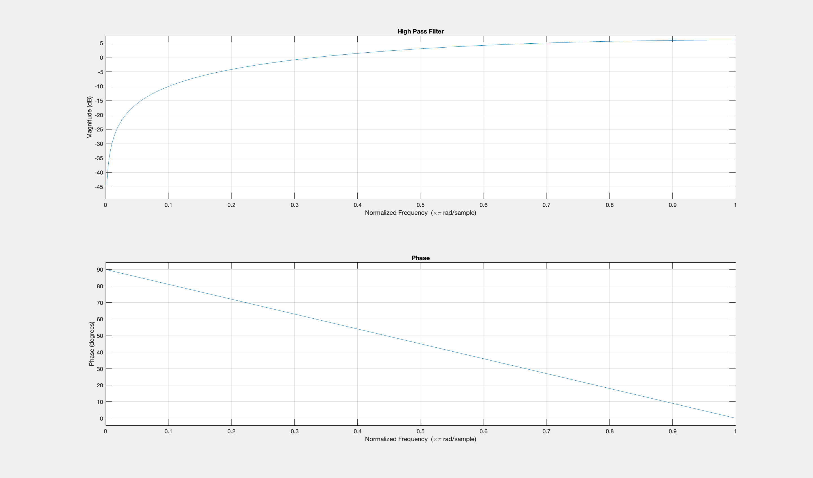
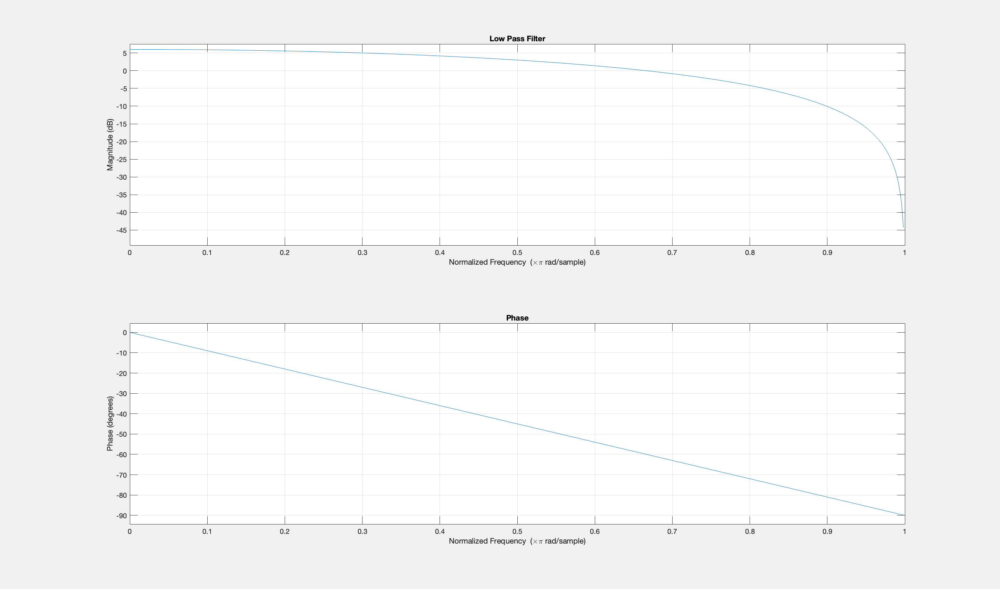

# FIR Filter Design using the Z-Transform

Design and frequency-domain analysis of first-order **Low-Pass** and **High-Pass FIR filters**, derived directly from their Z-domain transfer functions and verified through MATLAB's `freqz`.

## 📖 Overview

Digital filters are core building blocks in signal processing — used to isolate or suppress specific frequency components in a discrete-time signal. This project derives two simple first-order FIR filters from their Z-transform, converts them into difference equations, and analyses their magnitude and phase response.

| Filter | Transfer Function `H(z)` | Difference Equation |
|---|---|---|
| **Low-Pass (LPF)** | `H(z) = (z + 1) / z` | `y[n] = x[n] + x[n-1]` |
| **High-Pass (HPF)** | `H(z) = (z - 1) / z` | `y[n] = x[n] - x[n-1]` |

The LPF averages consecutive samples, smoothing out fast (high-frequency) variations while preserving slow trends. The HPF takes the difference between consecutive samples, emphasizing rapid changes and attenuating slow-varying (low-frequency) content — useful for tasks like edge/transient detection or removing DC offset.

## 🧠 Method

1. Define each transfer function symbolically in the Z-domain using MATLAB's Symbolic Math Toolbox.
2. Extract the numerator/denominator polynomial coefficients with `numden` and `sym2poly`.
3. Evaluate the frequency response by substituting `z = e^{jω}` (handled internally by `freqz`), sweeping the normalized frequency from `0` to `π` rad/sample.
4. Plot the **magnitude response** (in dB) and **phase response** (in degrees) for each filter.

## 📊 Results

**High-Pass Filter** — magnitude rises with frequency (attenuates near DC, passes near Nyquist):



**Low-Pass Filter** — magnitude falls with frequency (passes near DC, attenuates near Nyquist):



Both filters show the expected complementary behavior, confirming the frequency response of each system matches its Z-domain transfer function.

## 🛠️ Running the Code

Requirements: MATLAB with the **Symbolic Math Toolbox**.

```matlab
fir_filter_design
```

This will print the numerator/denominator coefficients for both filters to the console and generate two figures — one for the LPF response, one for the HPF response.

## 📁 Repository Structure

```
.
├── fir_filter_design.m   # Main MATLAB script
├── images/
│   ├── high_pass_filter_response.png
│   ├── low_pass_filter_response.png
│   └── filter_response.fig   # Editable MATLAB figure
└── README.md
```

## 📄 License

MIT — see [LICENSE](LICENSE).
